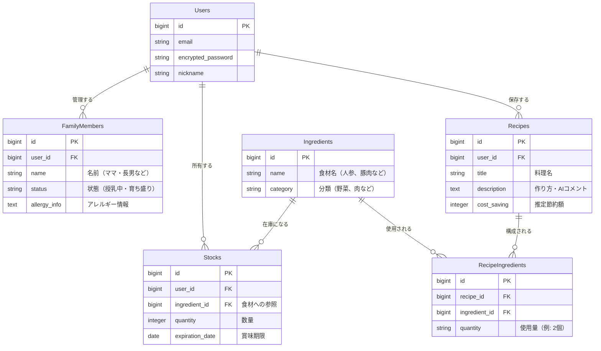

## 1. アプリ名（仮）
**Family Chef（ファミリーシェフ）**
～産後の妻と子供を守る、論理的献立・在庫管理アプリ～

## 2. アプリの目的・コンセプト（Why）
*   **背景:**
    *   産休・育休による収入減（経済的制約）。
    *   産後の母体や成長期の子供に必要な栄養管理の難しさ（栄養学的制約）。
    *   冷蔵庫の余り物を把握しきれないことによる食品ロス。
*   **目的:**
    *   冷蔵庫の在庫を「論理的」に管理し、AIを用いて「栄養」と「節約」を両立する献立を提案することで、家事を担当する夫（自分）の意思決定コストを下げる。

## 3. ターゲットユーザー
*   産後の妻や小さな子供を持ち、料理を担当する父親（自分）。
*   節約と健康管理を両立したいが、献立を考えるのが苦手な人。

## 4. 実装する機能（What）

ここは**「MVP（Minimum Viable Product：実用最小限の製品）」**から順に作ります。まずは★マーク（必須）の実装を目指しましょう。

### ① ユーザー・家族管理機能
*   **★ユーザー登録/ログイン:**（Devise使用）
*   **★家族ステータス登録:**
    *   妻（例：授乳中、産後ケア期）
    *   子供（例：離乳食中期、卵アレルギー）
    *   ※このステータスがAIへのプロンプト（命令文）に自動で組み込まれます。

### ② 食材在庫管理機能（多対多の学習用）
*   **★食材（Ingredients）登録:**
    *   冷蔵庫にある食材を登録・編集・削除。
    *   カテゴリー（肉、野菜、調味料など）。
    *   賞味期限（オプション：期限が近い順に表示するため）。

### ③ AI献立提案機能（目玉機能）
*   **★AIへの相談（Generate Recipe）:**
    *   ボタンを押すと、OpenAI APIが以下の要素を掛け合わせてレシピを提案。
        1.  **現在庫**（ここにあるものを使って！）
        2.  **家族ステータス**（鉄分多めで！）
        3.  **アレルギー情報**（卵は除去して！）
*   **レシピ保存:** 気に入った提案をデータベースに保存。

### ④ 献立・実績記録機能
*   **作ったログ:** 提案されたレシピを「作った（食べた）」として記録。
*   **★在庫の自動消費:** 「作った」とすると、使われた食材が在庫から自動で減る（※ここはロジックが難しいので、まずは手動削除でもOKですが、挑戦ポイントです）。

### ⑤ 節約実績の可視化（モチベーション）
*   **コスト比較:** 外食した場合の概算コストと、自炊コストを比較し、「今月〇〇円節約しました」と表示。

---

## 5. 技術スタック（How）
*   **Backend:** Ruby on Rails 7
*   **Frontend:** HTML/CSS (Tailwind CSS), JavaScript (Stimulus)
*   **Database:** PostgreSQL
*   **Infra:** Render (デプロイ経験済みのため) or ローカル環境のみでも可
*   **API:** OpenAI API

---

## 6. データモデル設計（ER図の準備）
**ここが最大の学習ポイントです。**

以下のテーブルが必要になりそうです。

1.  **Users:** ユーザー（パパ）
2.  **FamilyProfiles:** 家族の体調・アレルギー情報
3.  **Ingredients:** 食材マスタ（じゃがいも、人参...）
4.  **Stocks:** ユーザーが今持っている在庫（UserとIngredientの中間テーブルに近い）
5.  **Recipes:** 提案・保存されたレシピ
6.  **RecipeIngredients:** レシピと食材を結ぶ**中間テーブル（多対多）**

---

## 7. ER図

---

