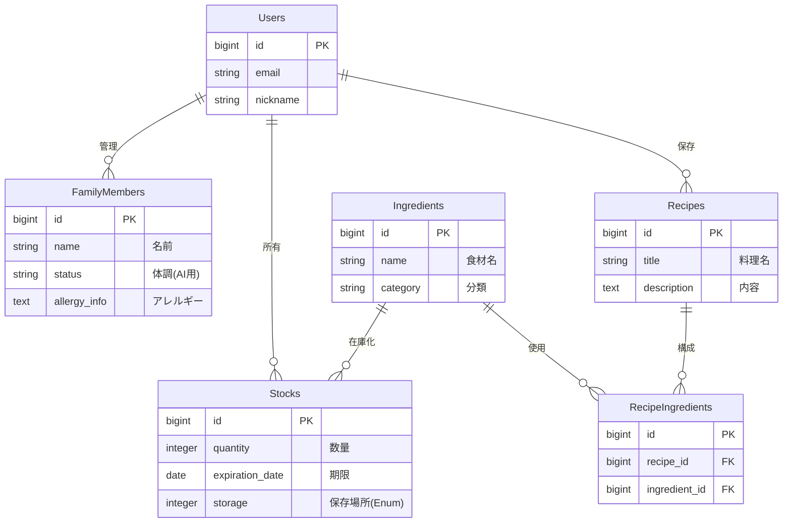

# Family Chef（ファミリーシェフ）
**～産後の妻と子供を守る、論理的献立・在庫管理AIパートナー～**

<!-- ここにトップ画面やロゴの画像を貼るとベストです -->
<!--  -->

## 1. アプリケーション概要
「冷蔵庫の余り物」と「家族の健康状態」という2つの変数をかけ合わせ、**AIが最適な献立を提案する**アプリケーションです。
産休・育休による収入変化（経済的制約）と、産後の母体や成長期の子供に必要な栄養管理（栄養学的制約）という、家庭内の複雑な課題をシステムで解決するために開発しました。

## 2. 開発背景（Why）
第一子の誕生と妻の産休を機に、「節約」と「栄養管理」の両立が急務となりました。しかし、冷蔵庫の中身を把握しながら、アレルギーや体調を考慮して献立を考える作業は、脳のリソースを大きく消費します。
そこで、**「在庫管理」と「献立決定」のプロセスを論理的に構造化し、生成AIにアウトソーシングする**ことで、家事の負担を減らしつつ、家族の健康を守りたいと考え、開発に至りました。

## 3. 主な機能

### 🤖 AI献立提案（Serviceクラスによる実装）
*   **在庫 × 家族ステータス:** 「冷蔵庫にある豚肉（期限間近）」と「授乳中の妻（鉄分必要）」といった情報を組み合わせ、AIが最適なレシピを提案します。
*   **対話型リクエスト:** 「今日はガッツリ食べたい」「和風で」といったユーザーの気分も加味して生成可能です。

### 🥦 在庫管理（多対多・Enum）
*   **食材マスタ:** カテゴリー（肉、野菜など）ごとに整理されたマスタデータから選択登録。
*   **状態管理:** 保存場所（冷蔵・冷凍・常温）を `Enum` で管理し、実態に即した管理を実現。

### 👨‍👩‍👧 家族ステータス管理
*   家族ごとの「現在の体調（授乳中など）」や「アレルギー情報」を登録。これがプロンプトのコンテキスト（文脈）としてAIに渡されます。

## 4. 使用技術（Tech Stack）

*   **Backend:** Ruby 3.2 / Ruby on Rails 7.1
*   **Frontend:** Tailwind CSS (v4) / JavaScript (Stimulus)
*   **Database:** MySQL 8.0
*   **Infrastructure:** (ローカル開発中 / Render予定)
*   **API:** OpenAI API (gpt-4o-mini)
*   **Tools:** Docker / RuboCop / Git / GitHub

## 5. 技術的なこだわり・挑戦（Technical Highlights）

### ① 複雑なデータ構造の正規化（多対多）
「レシピ」と「食材」の関係を適切に表現するため、中間テーブル `RecipeIngredients` を用いた**多対多（Many-to-Many）のリレーション**を設計しました。
スクールのカリキュラム範囲を超え、ER図を書き直してデータの整合性を担保しました。

### ② Serviceクラスによる「Fat Controller」の回避
OpenAI APIとの通信やプロンプト生成ロジックをコントローラーに記述すると肥大化するため、**`MenuGeneratorService` クラス**を独自に定義し、ビジネスロジックを切り出しました。これにより、保守性と可読性を高めています。

### ③ N+1問題の解消とパフォーマンス意識
在庫一覧画面において、食材データ（Ingredient）へのアクセスがN+1問題を引き起こすことをログで検知し、`includes` メソッドを用いてEager Loading（事前読み込み）を実装しました。

### ④ 最新技術へのキャッチアップ
CSSフレームワークには最新の **Tailwind CSS v4** を採用。従来の `tailwind.config.js` ではなくCSSネイティブな設定方法を公式ドキュメントで調査し、導入しました。

### ⑤ 静的解析ツール（RuboCop）の導入
チーム開発を見据え、コードの品質を一定に保つためにRuboCopを導入。自動修正だけでなく、メソッドの行数制限などの警告を通じてリーダブルコードを意識した実装を行っています。

## 6. データベース設計（ER図）

## 7. 今後の展望
*   **在庫の自動消費機能:** レシピを作成（調理）した際、使用された食材分を在庫から自動で減算するロジックの実装。
*   **コスト計算機能:** 「自炊によっていくら節約できたか」を可視化する機能。

---

